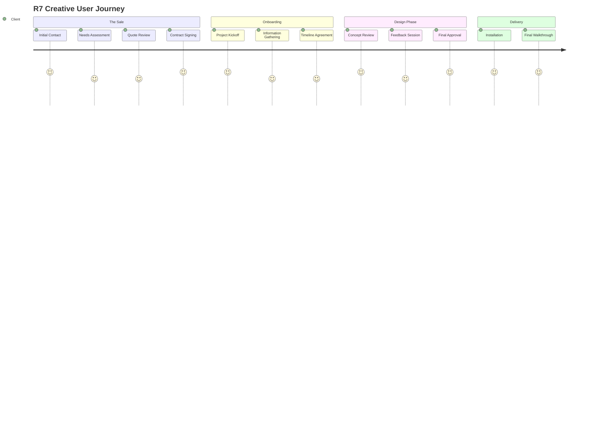

```mermaid
journey
    title R7 Creative User Journey
    section The Sale
      Initial Contact: 5: Client
      Needs Assessment: 4: Client
      Quote Review: 4: Client
      Contract Signing: 5: Client
    section Onboarding
      Project Kickoff: 5: Client
      Information Gathering: 4: Client
      Timeline Agreement: 4: Client
    section Design Phase
      Concept Review: 5: Client
      Feedback Session: 4: Client
      Final Approval: 5: Client
    section Delivery
      Installation: 5: Client
      Final Walkthrough: 5: Client
```

```mermaid
graph TD;
    A-->B;
    A-->C;
    B-->D;
    C-->D;
```